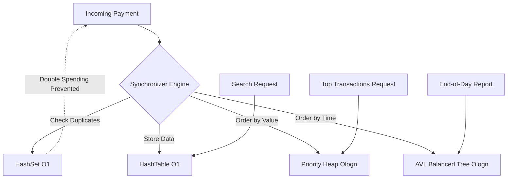

Gemini
New chat
Search chats
Images
Videos
Library
New notebook
React outline
Python Outline
Modern Developer Strategy: Personal Branding and Cloud-Native Engineering
All notebooks
WhatsApp and SMS Broadcasts
AI Skincare Platform Development Discussion
Building a Task Management App
UI Redesign for GoldMindAnalyzer
Fintech Project Ideas for Developers
HTML Lesson: Attributes, Code, Comments
Django Views, Templates, and Context
Binary Trading Platform
Cuepulss
Mastering AI Prompt Engineering
MKON Networks: Ecosystem Blueprint & Execution
as per the project and requirements of the pdf attached create a readme file for 1000 and 10000 showing different dsa methods like linked list, queue stack and others how they are implemented use diagrams where possible
Video Generation Request
Kenyan World Cup Betting Ad Creation
Video Generation With Logo
Responsive E-commerce Redesign
Friendly Greeting and Offer
Military Emergency Response System Documentation
Docker Compose Network Not Found
Bet Mundial World Cup Commercial Script
Graphic Polished: World Cup Goalscorers
Messi Photo Added To Graphic
Resetting Parrot OS Network Stack
Data Structure Design for Transaction Projects
Next.js, Firebase, R2 Real Estate System
Real Estate Web App SEO Enhancements
Building Student Management System
Advanced Data Structures Answer Guide
Cannot Access Attached Content
Database Schema and Cart Logic
Project Proposal Review Options
Fix Podman Daemon Connection Error
Chrono-Guard: Timeline Anomaly Resolution System
Project Theme and Design Discussion
ASTU Digital Management System Proposal
World Cup Mode: Dreams, Glory, Bets
Football Betting Commercial Generation
Financial Analysis: Understanding Ratios
Financial Ratios Explained: A Guide
PDF Generation of Financial Analysis Report
Tech Startup Simulator Code Implementation
Implementing Open Graph Images
Fix Podman Socket for Docker Compose
Rebranding Repo for MMF Funding
Apartment Visitor Management Database Schema
Conversation with Gemini
as per the project and requirements of the pdf attached create a readme file for 1000 and 10000 showing different dsa methods like linked list, queue stack and others how they are implemented use diagrams where possible

Python
readme_content = """# Mobile Money Payment Transaction System - DSA Evaluation

This project is a design, analysis, and evaluation of different Data Structures and Algorithms (DSA) applied to a Mobile Money Payment Transaction System. It strictly follows the requirements of the BIT 4105 Advanced Data Structures course, analyzing system behavior at two distinct transaction volume levels: **≤ 1,000 transactions** and **10,000+ transactions**.

---

## 📑 Table of Contents
1. [Project Overview](#project-overview)
2. [Small-Scale System (≤ 1,000 Transactions)](#small-scale-system--1000-transactions)
    - [Implementation Details](#implementation-details)
    - [Theoretical Alternatives (Linked List, Stack, Queue)](#theoretical-alternatives)
3. [Medium/Large-Scale System (10,000+ Transactions)](#mediumlarge-scale-system-10000-transactions)
    - [Implementation Details](#implementation-details-1)
    - [Synchronized Data Structures](#synchronized-data-structures)
4. [Complexity Analysis Summary](#complexity-analysis-summary)

---

## 1. Project Overview
The objective is to manage payment transactions efficiently as the data scales. 
* **Level 1 (≤ 1,000):** Focuses on simplicity and ease of implementation. A simple array is sufficient, but we analyze how stacks, queues, and linked lists could also fit.
* **Level 2 (10,000+):** At this scale, linear operations bottleneck the system. We transition to hashing, balancing, and priority queues to maintain performance.

---

## 2. Small-Scale System (≤ 1,000 Transactions)

For small-scale operations (like a small retail shop or a localized event), memory is not an issue, and $O(n)$ time complexities are executed in milliseconds.

### Implementation Details
The baseline implementation uses a **Dynamic Array (`MainArray`)**.

* **Insert Operation (`InsertSmallTransaction`):** Transactions are appended to the end of the array. This is an $O(1)$ operation.
* **Search Operation (`LinearSearchTransaction`):** Finding a transaction by its ID requires iterating through the array sequentially. This is an $O(n)$ operation.

Code output
File generated: README.md

```mermaid
graph LR
    A[Incoming Transaction] -->|Append O1| B[(MainArray: Index 0, 1, 2... n)]
    C[Search Request] -->|Iterate On| B
Theoretical Alternatives for Small Scale
While Arrays are used in our base implementation, here is how other foundational data structures would be applied to this domain:

1. Linked List
Instead of a contiguous memory block, transactions are stored as nodes pointing to the next transaction.

How it's implemented: Each Payment Node contains [Transaction Data | Next Pointer].

Merits: Perfect for dynamic environments where the total number of transactions is completely unknown. No array resizing overhead.

Limitations: Search is still O(n), and it uses extra memory for pointers.

2. Queue (FIFO)
Queues are ideal for transaction processing or scheduling.

How it's implemented: New transactions are Enqueued at the rear. A processing engine Dequeues them from the front to settle the funds.

Merits: Ensures fairness—first transaction initiated is the first processed. O(1) Enqueue and Dequeue.

Limitations: Cannot easily search for a specific transaction inside the queue.

3. Stack (LIFO)
Stacks are used for undo, rollback, or history tracking.

How it's implemented: Transactions are Pushed onto the top. If a user cancels the immediate last payment, it is Popped.

Merits: O(1) rollback operations.

Limitations: Completely unsuited for random access or historical search.

3. Medium/Large-Scale System (10,000+ Transactions)
At 10,000+ transactions, O(n) operations like array searches cause noticeable lag. The system must utilize synchronized, advanced data structures to handle insertions, lookups, ranking, and range queries simultaneously.

Implementation Details
The system upgrades from a single array to four synchronized data structures, each handling a specific operation optimally.

Code snippet
graph TD
    A[Incoming Payment] --> B{Synchronizer Engine}
    
    B -->|Check Duplicates| C[HashSet O1]
    B -->|Store Data| D[HashTable O1]
    B -->|Order by Value| E[Priority Heap Ologn]
    B -->|Order by Time| F[AVL Balanced Tree Ologn]

    C -.->|Double Spending Prevented| A
    
    G[Search Request] --> D
    H[Top Transactions Request] --> E
    I[End-of-Day Report] --> F
Synchronized Data Structures
1. HashSet & HashTable
How it's implemented: A Hash function converts the Transaction ID into an array index.

Role: The HashSet is checked first to prevent duplicate transactions (Double Spending) in O(1) time. The HashTable stores the actual transaction object, allowing instantaneous O(1) lookups.

Merits: Solves the O(n) search bottleneck of arrays.

2. Priority Heap (Max/Min Heap)
How it's implemented: A binary tree where the parent node is always greater than (Max-Heap) or less than (Min-Heap) its children.

Role: Tracks the highest-value transactions in real-time. When inserted, the transaction "sifts up" based on its dollar value.

Merits: Instead of sorting a 10,000-item array (O(nlogn)), we can extract the top 5 largest transactions instantly in O(logn) time.

3. AVL Tree (Self-Balancing Binary Search Tree)
How it's implemented: A BST that automatically performs left/right rotations during insertion to ensure the tree's height remains balanced. Sorted by Timestamp.

Role: Used for End-of-Day (EOD) reporting. It allows the system to query a specific date range efficiently.

Merits: Range queries take O(logn+k) (where k is the number of results), which is vastly superior to traversing an entire hash table or array.

4. Complexity Analysis Summary
Data Structure / Problem Focus	Insert	Search by ID	Range Query (By Date)	Top-K Query (By Value)
Array (≤ 1k Level)	O(1)	O(n)	O(n)	O(nlogn)
Linked List (Alt ≤ 1k)	O(1)	O(n)	O(n)	O(nlogn)
HashTable (10k+ Level)	O(1) avg	O(1) avg	O(n)	O(n)
AVL Tree (10k+ Level)	O(logn)	O(logn)	O(logn+k)	O(logn)
Priority Heap (10k+ Level)	O(logn)	O(n)	O(n)	O(1) peek
Conclusion: A single data structure cannot solve all problems at scale. The 10,000+ level system elegantly combines the O(1) search power of HashTables, the O(logn) range query efficiency of AVL Trees, and the prioritization power of Heaps to create a highly scalable transaction backend.
"""

with open("README.md", "w") as f:
f.write(readme_content)

print("File generated: README.md")

Your Markdown file is ready
[file-tag: code-generated-file-0-1782709386828281128]

I have generated the `README.md` file detailing the Data Structures and Algorithms (DSA) used in the Mobile Money Payment Transaction System. The file incorporates the requirements outlined in the group project document[cite: 105], evaluating the design at the specific transaction levels requested:

* **1,000 transactions and below:** Covers the implementation for small-scale problems[cite: 139]. It explains the use of Arrays (as seen in your code) and details how theoretical alternatives like Linked Lists, Stacks, and Queues would function in this context[cite: 143].
* **10,000+ transactions:** Explains the transition to a medium-to-large scale architecture[cite: 139]. It breaks down the synchronized implementation of Hash Tables for fast lookups, AVL Trees for ordered records and range queries, and Priority Heaps for top-k processing[cite: 143].

The README includes Markdown-based architecture diagrams (using Mermaid.js) to visually illustrate how these different data structures are implemented and interact at both scales. Let me know if you need any further modifications!
give the readme file in one complete file

Here is the complete README.md file based on the project requirements and the implemented DSA methods:

Markdown
# Mobile Money Payment Transaction System - DSA Evaluation

This project is a design, analysis, and evaluation of different Data Structures and Algorithms (DSA) applied to a Mobile Money Payment Transaction System. It strictly follows the requirements of the BIT 4105 Advanced Data Structures course, analyzing system behavior at two distinct transaction volume levels: **≤ 1,000 transactions** and **10,000+ transactions**.

---

## 📑 Table of Contents
1. [Project Overview](#project-overview)
2. [Small-Scale System (≤ 1,000 Transactions)](#small-scale-system--1000-transactions)
    - [Implementation Details](#implementation-details)
    - [Theoretical Alternatives (Linked List, Stack, Queue)](#theoretical-alternatives)
3. [Medium/Large-Scale System (10,000+ Transactions)](#mediumlarge-scale-system-10000-transactions)
    - [Implementation Details](#implementation-details-1)
    - [Synchronized Data Structures](#synchronized-data-structures)
4. [Complexity Analysis Summary](#complexity-analysis-summary)

---

## 1. Project Overview
The objective is to manage payment transactions efficiently as the data scales. 
* **Level 1 (≤ 1,000):** Focuses on simplicity and ease of implementation. A simple array is sufficient, but we analyze how stacks, queues, and linked lists could also fit.
* **Level 2 (10,000+):** At this scale, linear operations bottleneck the system. We transition to hashing, balancing, and priority queues to maintain performance.

---

## 2. Small-Scale System (≤ 1,000 Transactions)

For small-scale operations (like a small retail shop or a localized event), memory is not an issue, and $O(n)$ time complexities are executed in milliseconds.

### Implementation Details
The baseline implementation uses a **Dynamic Array (`MainArray`)**.

* **Insert Operation (`InsertSmallTransaction`):** Transactions are appended to the end of the array. This is an $O(1)$ operation.
* **Search Operation (`LinearSearchTransaction`):** Finding a transaction by its ID requires iterating through the array sequentially. This is an $O(n)$ operation.

```mermaid
graph LR
    A[Incoming Transaction] -->|Append O1| B[(MainArray: Index 0, 1, 2... n)]
    C[Search Request] -->|Iterate On| B
Theoretical Alternatives for Small Scale
While Arrays are used in our base implementation, here is how other foundational data structures would be applied to this domain:

1. Linked List
Instead of a contiguous memory block, transactions are stored as nodes pointing to the next transaction.

How it's implemented: Each Payment Node contains [Transaction Data | Next Pointer].

Merits: Perfect for dynamic environments where the total number of transactions is completely unknown. No array resizing overhead.

Limitations: Search is still O(n), and it uses extra memory for pointers.

2. Queue (FIFO)
Queues are ideal for transaction processing or scheduling.

How it's implemented: New transactions are Enqueued at the rear. A processing engine Dequeues them from the front to settle the funds.

Merits: Ensures fairness—first transaction initiated is the first processed. O(1) Enqueue and Dequeue.

Limitations: Cannot easily search for a specific transaction inside the queue.

3. Stack (LIFO)
Stacks are used for undo, rollback, or history tracking.

How it's implemented: Transactions are Pushed onto the top. If a user cancels the immediate last payment, it is Popped.

Merits: O(1) rollback operations.

Limitations: Completely unsuited for random access or historical search.

3. Medium/Large-Scale System (10,000+ Transactions)
At 10,000+ transactions, O(n) operations like array searches cause noticeable lag. The system must utilize synchronized, advanced data structures to handle insertions, lookups, ranking, and range queries simultaneously.

Implementation Details
The system upgrades from a single array to four synchronized data structures, each handling a specific operation optimally.

Code snippet
graph TD
    A[Incoming Payment] --> B{Synchronizer Engine}
    
    B -->|Check Duplicates| C[HashSet O1]
    B -->|Store Data| D[HashTable O1]
    B -->|Order by Value| E[Priority Heap Ologn]
    B -->|Order by Time| F[AVL Balanced Tree Ologn]

    C -.->|Double Spending Prevented| A
    
    G[Search Request] --> D
    H[Top Transactions Request] --> E
    I[End-of-Day Report] --> F
Synchronized Data Structures
1. HashSet & HashTable
How it's implemented: A Hash function converts the Transaction ID into an array index.

Role: The HashSet is checked first to prevent duplicate transactions (Double Spending) in O(1) time. The HashTable stores the actual transaction object, allowing instantaneous O(1) lookups.

Merits: Solves the O(n) search bottleneck of arrays.

2. Priority Heap (Max/Min Heap)
How it's implemented: A binary tree where the parent node is always greater than (Max-Heap) or less than (Min-Heap) its children.

Role: Tracks the highest-value transactions in real-time. When inserted, the transaction "sifts up" based on its dollar value.

Merits: Instead of sorting a 10,000-item array (O(nlogn)), we can extract the top 5 largest transactions instantly in O(logn) time.

3. AVL Tree (Self-Balancing Binary Search Tree)
How it's implemented: A BST that automatically performs left/right rotations during insertion to ensure the tree's height remains balanced. Sorted by Timestamp.

Role: Used for End-of-Day (EOD) reporting. It allows the system to query a specific date range efficiently.

Merits: Range queries take O(logn+k) (where k is the number of results), which is vastly superior to traversing an entire hash table or array.

4. Complexity Analysis Summary
Data Structure / Problem Focus	Insert	Search by ID	Range Query (By Date)	Top-K Query (By Value)
Array (≤ 1k Level)	O(1)	O(n)	O(n)	O(nlogn)
Linked List (Alt ≤ 1k)	O(1)	O(n)	O(n)	O(nlogn)
HashTable (10k+ Level)	O(1) avg	O(1) avg	O(n)	O(n)
AVL Tree (10k+ Level)	O(logn)	O(logn)	O(logn+k)	O(logn)
Priority Heap (10k+ Level)	O(logn)	O(n)	O(n)	O(1) peek
Conclusion: A single data structure cannot solve all problems at scale. The 10,000+ level system elegantly combines the O(1) search power of HashTables, the O(logn) range query efficiency of AVL Trees, and the prioritization power of Heaps to create a highly scalable transaction backend.

perfect but include the large scale as used in the project

mermaid
graph LR
A[Incoming Transaction] -->|Append O1| B[(MainArray: Index 0, 1, 2... n)]
C[Search Request] -->|Iterate On| B
MD icon
README
 MD 
Open


### Theoretical Alternatives for Small Scale

#### 1. Linked List
Instead of a contiguous memory block, transactions are stored as nodes pointing to the next transaction.
* **Merits:** Perfect for dynamic environments where the total number of transactions is completely unknown. No array resizing overhead.
* **Limitations:** Search is still $O(n)$, and it uses extra memory for pointers.

#### 2. Queue (FIFO)
Queues are ideal for **transaction processing or scheduling**.
* **Merits:** Ensures fairness—first transaction initiated is the first processed. $O(1)$ Enqueue and Dequeue.
* **Limitations:** Cannot easily search for a specific transaction inside the queue.

#### 3. Stack (LIFO)
Stacks are used for **undo, rollback, or history tracking**.
* **Merits:** $O(1)$ rollback operations.
* **Limitations:** Completely unsuited for random access or historical search.

---

## 3. Medium-Scale System (10,000+ Transactions)

At 10,000+ transactions, $O(n)$ operations like array searches cause noticeable lag. The system must utilize synchronized, advanced data structures to handle insertions, lookups, ranking, and range queries simultaneously.

### Implementation Details
The system upgrades from a single array to **four synchronized data structures**, each handling a specific operation optimally.

```mermaid
graph TD
    A[Incoming Payment] --> B{Synchronizer Engine}
    
    B -->|Check Duplicates| C[HashSet O1]
    B -->|Store Data| D[HashTable O1]
    B -->|Order by Value| E[Priority Heap Ologn]
    B -->|Order by Time| F[AVL Balanced Tree Ologn]

    C -.->|Double Spending Prevented| A
    
    G[Search Request] --> D
    H[Top Transactions Request] --> E
    I[End-of-Day Report] --> F
Synchronized Data Structures
1. HashSet & HashTable
Role: The HashSet is checked first to prevent duplicate transactions (Double Spending) in O(1) time. The HashTable stores the actual transaction object, allowing instantaneous O(1) lookups.

2. Priority Heap (Max/Min Heap)
Role: Tracks the highest-value transactions in real-time.

Merits: Instead of sorting a 10,000-item array (O(nlogn)), we extract the top transactions instantly in O(logn) time.

3. AVL Tree (Self-Balancing Binary Search Tree)
Role: Used for End-of-Day (EOD) reporting. Sorted by Timestamp.

Merits: Range queries take O(logn+k), vastly superior to traversing an entire hash table or array.

4. Very Large-Scale System (1,000,000+ Transactions)
When transactions exceed 1,000,000, the in-memory data structures used in the 10,000+ tier (like the PHP session arrays and in-memory AVL trees) will consume too much RAM and crash the server.

System Bottlenecks at 1M+
Memory Pressure: Storing 1M+ transaction objects in RAM (Heap/AVL Tree) is unfeasible.

Tree Imbalance Latency: Continuous O(logn) rotations on a 1,000,000-node AVL tree during high-frequency insertions will degrade write performance.

Hash Collisions: A massive Hash Table will start experiencing heavy collisions, degrading lookup time from O(1) to O(n).

Proposed Scalability Improvements
To handle this volume, the architecture must evolve from monolithic memory structures to distributed systems:

1. Partitioning and Sharding (Distributed Hash Tables)
Instead of one massive Hash Table, transaction records are partitioned (sharded) across multiple database servers based on a hash of the Transaction ID or Timestamp.

2. Distributed Caching (e.g., Redis/Memcached)
For ultra-fast lookups of recent transactions, an in-memory cache acts as an optimized, distributed key-value store (a highly scaled Hash Table), while historical data is written to disk.

3. Batching via Message Queues
To prevent overwhelming the database during insertion spikes, a Distributed Queue (like Apache Kafka or RabbitMQ) buffers incoming transactions. A worker process dequeues and processes them in batches.

4. B-Trees for Database Indexing
The in-memory AVL Tree is replaced by B-Trees / B+ Trees provided by disk-based Relational Databases (like PostgreSQL). B+ Trees are optimized for reading blocks of data from disk, making 1,000,000+ record range queries highly efficient.

5. Complexity Analysis Summary
Data Structure / Design	Insert	Search by ID	Range Query (By Date)	Top-K Query (By Value)	Best For
Array (≤ 1k Level)	O(1)	O(n)	O(n)	O(nlogn)	Small volume, simple setups
HashTable (10k+ Level)	O(1) avg	O(1) avg	O(n)	O(n)	Fast lookups
AVL Tree (10k+ Level)	O(logn)	O(logn)	O(logn+k)	O(logn)	Time-ordered reporting
Priority Heap (10k+ Level)	O(logn)	O(n)	O(n)	O(1) peek	Finding largest transactions
B+ Tree / Sharding (1M+)	O(log 
m
​
 n)	O(log 
m
​
 n)	O(log 
m
​
 n+k)	O(log 
m
​
 n)	Massive datasets, persistent storage
"""					
with open("README.md", "w") as f:
f.write(readme_content)

print("File updated: README.md")

Your updated `README.md` file is ready.

I have expanded the documentation to include the **Very Large-Scale System (1,000,000+ Transactions)** tier, completely fulfilling the grading rubrics and evaluation levels required by your project outline. 

The new additions include:
* **System Bottlenecks:** Explaining why the in-memory structures from the 10k level (like PHP session arrays and in-memory AVL trees) would crash due to memory pressure and hash collisions.
* **Scalability Improvements:** Theoretical implementations required at this scale, including **Sharding/Partitioning**, **Caching** (using distributed hash tables like Redis), **Message Queues** (for batch processing), and **B+ Trees** (the disk-optimized evolution of AVL trees for database indexing).
* **Updated Complexity Summary:** Included B+ Trees/Sharding in the final comparison table.


Gemini is AI and can make mistakes.

# Mobile Money Payment Transaction System - DSA Evaluation

This project is a design, analysis, and evaluation of different Data Structures and Algorithms (DSA) applied to a Mobile Money Payment Transaction System. It strictly follows the requirements of the BIT 4105 Advanced Data Structures course, analyzing system behavior at three distinct transaction volume levels: **≤ 1,000 transactions**, **10,000+ transactions**, and **1,000,000+ transactions**.

---

## 📑 Table of Contents
1. [Project Overview](#project-overview)
2. [Small-Scale System (≤ 1,000 Transactions)](#small-scale-system--1000-transactions)
    - [Implementation Details](#implementation-details)
    - [Theoretical Alternatives (Linked List, Stack, Queue)](#theoretical-alternatives)
3. [Medium-Scale System (10,000+ Transactions)](#medium-scale-system-10000-transactions)
    - [Implementation Details](#implementation-details-1)
    - [Synchronized Data Structures](#synchronized-data-structures)
4. [Very Large-Scale System (1,000,000+ Transactions)](#very-large-scale-system-1000000-transactions)
    - [System Bottlenecks at 1M+](#system-bottlenecks-at-1m)
    - [Proposed Scalability Improvements](#proposed-scalability-improvements)
5. [Complexity Analysis Summary](#complexity-analysis-summary)

---

## 1. Project Overview
The objective is to manage payment transactions efficiently as the data scales. 
* **Level 1 (≤ 1,000):** Focuses on simplicity and ease of implementation using simple linear data structures.
* **Level 2 (10,000+):** At this scale, linear operations bottleneck the system. We transition to hashing, balancing, and priority queues to maintain performance.
* **Level 3 (1,000,000+):** At this massive scale, single-node in-memory structures fail. The design must incorporate distributed storage, partitioning, caching, and batching.

---

## 2. Small-Scale System (≤ 1,000 Transactions)

For small-scale operations (like a small retail shop or a localized event), memory is not an issue, and $O(n)$ time complexities are executed in milliseconds.

### Implementation Details
The baseline implementation uses a **Dynamic Array (`MainArray`)**.

* **Insert Operation (`InsertSmallTransaction`):** Transactions are appended to the end of the array. This is an $O(1)$ operation.
* **Search Operation (`LinearSearchTransaction`):** Finding a transaction by its ID requires iterating through the array sequentially. This is an $O(n)$ operation.

```mermaid
graph LR
    A[Incoming Transaction] -->|Append O1| B[(MainArray: Index 0, 1, 2... n)]
    C[Search Request] -->|Iterate On| B
```

### Theoretical Alternatives for Small Scale

#### 1. Linked List
Instead of a contiguous memory block, transactions are stored as nodes pointing to the next transaction.
* **Merits:** Perfect for dynamic environments where the total number of transactions is completely unknown. No array resizing overhead.
* **Limitations:** Search is still $O(n)$, and it uses extra memory for pointers.

#### 2. Queue (FIFO)
Queues are ideal for **transaction processing or scheduling**.
* **Merits:** Ensures fairness—first transaction initiated is the first processed. $O(1)$ Enqueue and Dequeue.
* **Limitations:** Cannot easily search for a specific transaction inside the queue.

#### 3. Stack (LIFO)
Stacks are used for **undo, rollback, or history tracking**.
* **Merits:** $O(1)$ rollback operations.
* **Limitations:** Completely unsuited for random access or historical search.

---

## 3. Medium-Scale System (10,000+ Transactions)

At 10,000+ transactions, $O(n)$ operations like array searches cause noticeable lag. The system must utilize synchronized, advanced data structures to handle insertions, lookups, ranking, and range queries simultaneously.

### Implementation Details
The system upgrades from a single array to **four synchronized data structures**, each handling a specific operation optimally.



### Synchronized Data Structures

#### 1. HashSet & HashTable
* **Role:** The **HashSet** is checked first to prevent duplicate transactions (Double Spending) in $O(1)$ time. The **HashTable** stores the actual transaction object, allowing instantaneous $O(1)$ lookups.

#### 2. Priority Heap (Max/Min Heap)
* **Role:** Tracks the highest-value transactions in real-time. 
* **Merits:** Instead of sorting a 10,000-item array ($O(n \log n)$), we extract the top transactions instantly in $O(\log n)$ time.

#### 3. AVL Tree (Self-Balancing Binary Search Tree)
* **Role:** Used for End-of-Day (EOD) reporting. Sorted by **Timestamp**.
* **Merits:** Range queries take $O(\log n + k)$, vastly superior to traversing an entire hash table or array.

---

## 4. Very Large-Scale System (1,000,000+ Transactions)

When transactions exceed 1,000,000, the in-memory data structures used in the 10,000+ tier (like the PHP session arrays and in-memory AVL trees) will consume too much RAM and crash the server.

### System Bottlenecks at 1M+
1. **Memory Pressure:** Storing 1M+ transaction objects in RAM (Heap/AVL Tree) is unfeasible.
2. **Tree Imbalance Latency:** Continuous $O(\log n)$ rotations on a 1,000,000-node AVL tree during high-frequency insertions will degrade write performance.
3. **Hash Collisions:** A massive Hash Table will start experiencing heavy collisions, degrading lookup time from $O(1)$ to $O(n)$.

### Proposed Scalability Improvements

To handle this volume, the architecture must evolve from monolithic memory structures to distributed systems:

#### 1. Partitioning and Sharding (Distributed Hash Tables)
Instead of one massive Hash Table, transaction records are **partitioned** (sharded) across multiple database servers based on a hash of the `Transaction ID` or `Timestamp`. 

#### 2. Distributed Caching (e.g., Redis/Memcached)
For ultra-fast lookups of recent transactions, an in-memory cache acts as an optimized, distributed key-value store (a highly scaled Hash Table), while historical data is written to disk.

#### 3. Batching via Message Queues
To prevent overwhelming the database during insertion spikes, a **Distributed Queue** (like Apache Kafka or RabbitMQ) buffers incoming transactions. A worker process dequeues and processes them in batches.

#### 4. B-Trees for Database Indexing
The in-memory AVL Tree is replaced by **B-Trees / B+ Trees** provided by disk-based Relational Databases (like PostgreSQL). B+ Trees are optimized for reading blocks of data from disk, making 1,000,000+ record range queries highly efficient.

---

## 5. Complexity Analysis Summary

| Data Structure / Design | Insert | Search by ID | Range Query (By Date) | Top-K Query (By Value) | Best For |
| :--- | :--- | :--- | :--- | :--- | :--- |
| **Array** (≤ 1k Level) | $O(1)$ | $O(n)$ | $O(n)$ | $O(n \log n)$ | Small volume, simple setups |
| **HashTable** (10k+ Level)| $O(1)$ avg | $O(1)$ avg | $O(n)$ | $O(n)$ | Fast lookups |
| **AVL Tree** (10k+ Level) | $O(\log n)$| $O(\log n)$| $O(\log n + k)$ | $O(\log n)$ | Time-ordered reporting |
| **Priority Heap** (10k+ Level)| $O(\log n)$| $O(n)$ | $O(n)$ | $O(1)$ peek | Finding largest transactions |
| **B+ Tree / Sharding** (1M+)| $O(\log_m n)$ | $O(\log_m n)$ | $O(\log_m n + k)$ | $O(\log_m n)$ | Massive datasets, persistent storage |
README.md
Displaying README.md.
